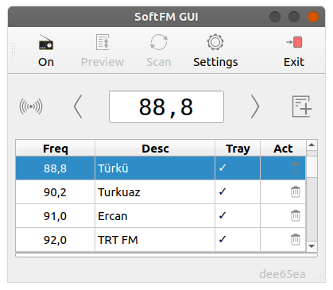

# SoftFM GUI

A GUI wrapper for [softfm](https://github.com/f4exb/ngsoftfm).


## Requirements
To use the gui, you will need;
* A SDR device. I have tested with a [Nooelec NESDR Mini](https://www.nooelec.com/store/sdr/sdr-receivers/nesdr-mini.html).
* SoftFM or any fork. I have tested with [hayguen/ngsoftfm](https://github.com/hayguen/ngsoftfm/tree/dev).
* A Linux distro. I have tested with Ubuntu 20.04.
* Build tools and Qt. `sudo apt install build-essential qt5-default`


## Building the code
To build and run, enter below commands.
```bash
cd <path_to_softfm-gui>
mkdir build
cd build
qmake ../src/softfm-gui.pro
make
./softfm-gui
```


## Screenshots


| *Basic* | *Dark* |
|:--:|:--:| 
|  |  | 


| *Advanced* | *Settings* |
|:--:|:--:| 
|  |  |

| *Tray* | *Scan* |
|:--:|:--:| 
|  |  |
